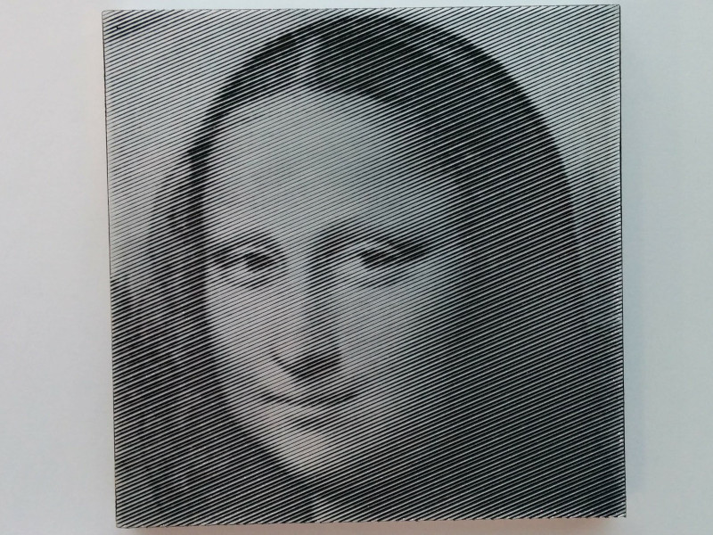

photo2cnccut
============

This python script generates cnc g-code and svg files from pictures,
converting grayscale pixel data to parallel lines with varying depths.

There is already a popular open source library, ``rastercarve``,
and I borrowed basic design and interfaces from it.
He explains the domain well, so I recommend reading his writings.

* `rastercarve README <https://github.com/built1n/rastercarve>`__
* `blog article 2019/11/28 <https://www.fwei.tk/blog/opening-black-boxes.html>`__
* `blog article 2020/01/04 <https://www.fwei.tk/blog/a-c-programmer-learns-javascript.html>`__

Motivation
----------

* The ``rastercarve`` author seems to use his script on modern wood cutting machines,
  while I wanted to cut aluminum on old industrial machines.
  One thing I had to do, among others, was to keep g-code short as much as possible.
  So I wanted to omit modal codes (e.g. repetitive G0 and G1).

* His script requires ``c++`` g-code parser for previewing (generating svg files).
  Since we already have points data in Python,
  I wanted to generate svg files straight from them.

Installation
------------

.. code-block:: bash

    $ pip install photo2cnccut

This script only requires PIL or `Pillow <https://pypi.org/project/Pillow/>`__
for g-code and svg.
(I have lightly checked that ``numpy`` doesn't improve performance).
For optional png generation, though,
it invokes `inkscape <https://inkscape.org/>`__ from shell.
So you also need it then.

Usage
-----

.. code-block:: bash

    $ photo2cnccut aa/mona.jpg

The command requires one argument, file path to a picture.
It generates g-code and svg files
(``aa/mona.jpg.nc`` and ``aa/mona.jpg.svg``).

If there is a valid python file ``p2cconfig.py``,
in the current directory *of the file path* (not the shell current directory),
and it has a top level variable ``config`` (python dictionary),
the script reads it, and updates default configuration accordingly.

So, if you want to convert ``aa/mona.jpg``,
there should be a file ``aa/p2cconfig.py``
to change the default. It should have lines like:

.. code-block:: python

    config = {
        'tool_angle': 60,
    }

For possible keys and values, run ``'-H'`` or ``'--Help'``,
or check the code `photo2cnccut.ui._CONFIG <src/photo2cnccut/ui.py>`__.

(For other commandline options, run ``'-h'`` or ``'--help'``,
or check the code `photo2cnccut.ui._build_args <src/photo2cnccut/ui.py>`__).

Usage2
------

If there is also a valid python file ``p2cmodule.py``,
in the current directory *of the file path*,
and it has a top level variable ``Data`` (python class),
the script runs with it,
instead of built-in `photo2cnccut.line.Data <src/photo2cnccut/line.py>`__.

It should make customization a bit easier.

.. More
.. ----

.. More pictures are found in
.. `my 'diary' <https://openandclose.github.io/category/cncdiaries.html>`__.

Examples
--------

If you want to see more cut pictures, visit my blog: 
`_ <https://openandclose.github.io/cncdiary/2021-02-21-cut-mona-lisa.html>`__,
`_ <https://openandclose.github.io/cncdiary/2021-03-23-cut-obama.html>`__,
`_ <https://openandclose.github.io/cncdiary/2021-03-24-cut-umezu.html>`__.

License
-------

The software is licensed under The MIT License. See `LICENSE`_.

.. _LICENSE: https://github.com/openandclose/photo2cnccut/blob/master/LICENSE
